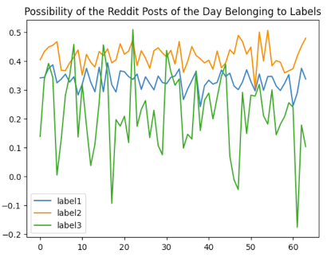
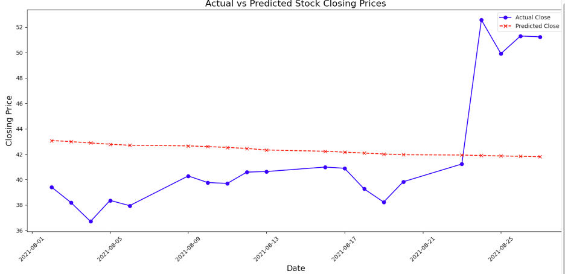
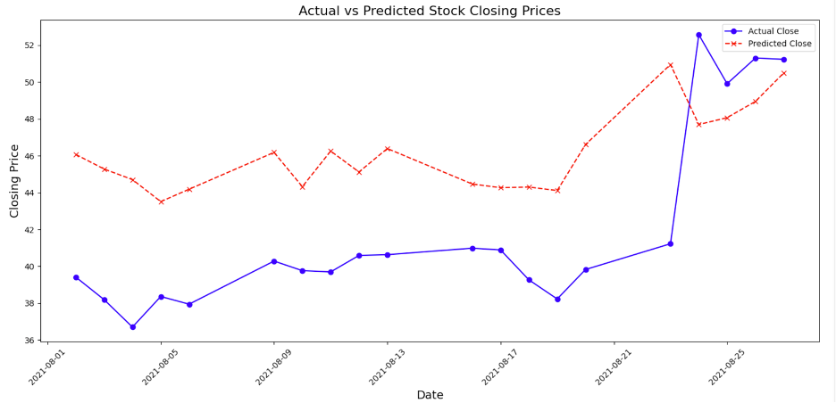

# GameStop Stock Prediction Using Sentiment Analysis and LSTM

## Overview

This project aims to predict GameStop's stock prices by integrating API scraping, time-series forecasting, and sentiment analysis models. The project utilizes LSTM networks for time-series forecasting and a fine-tuned BERT model for sentiment analysis, extracting public sentiment related to GameStop from Reddit.

## Steps and Approaches

**Data Scraping**
Stock Data: Utilized yfinance to scrape historical stock data.
Reddit Data: Scraped Reddit data using API.

**Sentiment Analysis** Sentiment Analysis: Fine-tuned a pre-trained BERT model with labeled posts to predict sentiment labels and convert posts into embeddings.

**Stock Prediction**
Historical Data Prediction: Used a 2-layer LSTM to predict stock prices based on historical data.

Sentiment-Incorporated Prediction: Enhanced prediction by incorporating sentiment analysis results into the LSTM model.

## Results and Accuracy
Sentiment Model: Achieved a test accuracy of 77.89% within 10 epochs.
Historical Data Model: MSE Loss of 0.0087 on the testing dataset.
Sentiment-Incorporated Model: Improved MSE Loss to 0.0062 on the testing dataset, demonstrating the value of incorporating social media sentiment into stock price predictions.

## Analysis Insights
The sentiment-incorporated model captured more fluctuations and showcased the potential of reflecting the impact of social media sentiment on stock prices.

## Overview

The GameStop short squeeze highlighted the influence of social media in modern financial markets. Integrating social media sentiment data into prediction models enhances the ability to perceive market sentiment shifts.

## Future Directions

Improving Model Adaptability: Explore advanced machine learning techniques like Transformer models.
Multisource Data Fusion: Integrate additional data sources like news reports and financial blogs.
Model Explainability: Enhance model explainability to understand the drivers behind predictions.
Data Quality and Ethics: Improve data cleaning methods and ensure ethical data usage.
